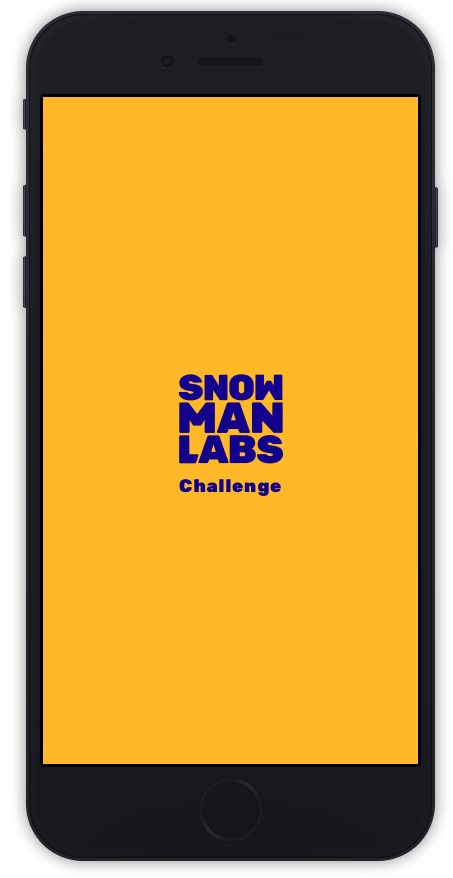

 

  

  <h3 align="center">Desafio Mobile :trophy:</h3>

  

    :suspect: Você está prepardo? :godmode:
     
     
    <a href="https://www.snowmanlabs.com.br/snow-team/">SnowTeam</a>
    ·
    <a href="https://groups.google.com/a/snowmanlabs.com/forum/#!forum/dev.challenge">Questions?</a>
    ·
    <a href="https://invis.io/STYNCV5G5D4">Design</a>
  

# Descrição do desafio

     
    
     
     
    <a href="https://invis.io/STYNCV5G5D4">
        Design »
    </a>
     

Nós queremos te conhecer melhor, então não tenha medo de falhar, isto não é sobre a maneira certa ou errada de fazer. Apenas dê o seu melhor. Boa sorte! :smile:

## Objetivo

:snowman: Seu time está desenvolvendo um app e precisa implementar uma nova feature, um FAQ (Frequently Asked Questions) e você foi incubido de desenvolver essa feature.

A lista de Perguntas e Respostas você encontra [aqui](assets/questions.txt).

## Non-functional specs

* Você deve escolher entre Android, iOS ou Flutter (De acordo com a vaga para qual você está aplicando).
* Você pode usar qualquer tecnologia que achar necessária ou legal.
* Os dados devem ser consumidos de um banco de dados local.
* Utilizar Firebase ou qualquer solução backend é opcional e um plus
* O app deve ser fácil para setup e deploy. :children_crossing:
* O app deve ter uma Splash Screen, uma tela com lista de perguntas/respostas e uma tela para criar nova pergunta/resposta
* Dê o seu melhor.

## User Stories

* Como usuário quero visualizar a lista de perguntas/respostas (FAQ).
* Como usuário quero clicar em uma pergunta e quero que a resposta seja exibida.
* Como usuário quero poder pesquisar uma pergunta/resposta.
* Como usuário quero poder criar uma nova pergunta/resposta.
* Como usuário quero adicionar uma cor a minha pergunta/resposta.

## Entregáveis

* O código fonte de um repositório público.
* Uma demo build.
* Instruções sobre como rodar o ambiente de desenvolvimento.
* Instruções sobre deploy.

## Avaliação

A avaliação vai seguir os seguintes critérios

* :dart: Boas práticas.
* :wrench: Manutenibilidade do código.
* :rocket: Performance.
* :watch: Full operation.
* :factory: Robustez.
* :iphone: Atenção aos detalhes

Registre tudo em seus commits e evite fazer commits muito grandes e com muitas alterações.

## Bonus Deliverable

Além de suas habilidades, também estamos interessados em como você pensa, a maneira como seu código evolui e cresce até que esteja pronto. Portanto, se você está se sentindo um [awesome developer streamer](https://github.com/bnb/awesome-developer-streams) :blush: :tv:, gostaríamos de ver um vídeo do seu processo de desenvolvimento. Isso nos permitiria entendê-lo melhor e dar-lhe um feedback mais completo.

## Dúvidas?

Se você tiver alguma dúvida sobre este desafio, você pode abrir um novo tópico ou pesquisar sua pergunta no [Dev Challenge forum](https://groups.google.com/a/snowmanlabs.com/forum/#!forum/dev.challenge). :love_letter:
